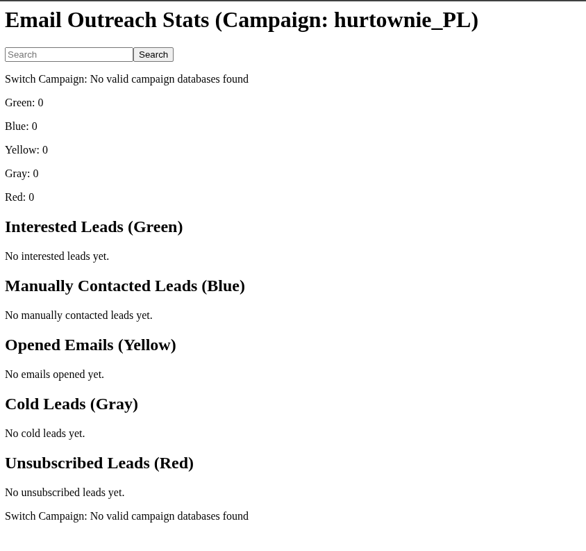
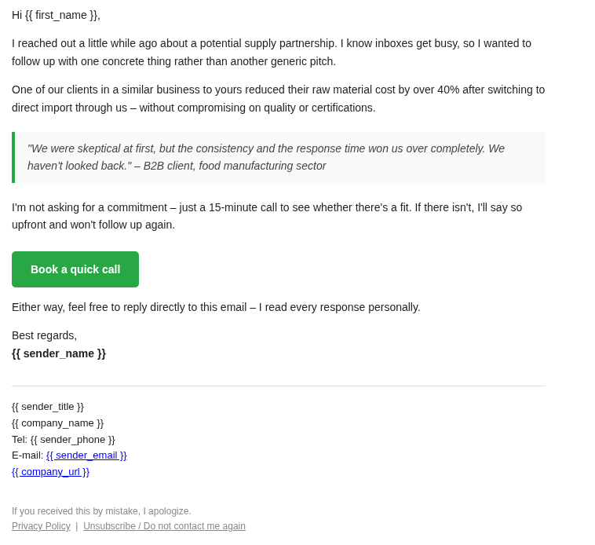

# Cold Email Outreach System

A self-hosted B2B email outreach platform with engagement tracking, lead scoring, multi-campaign management, and a web-based analytics dashboard — built entirely on first-party infrastructure.

---

## Problem It Solves

Standard email marketing platforms are designed for newsletters and broadcast communications, not targeted B2B cold outreach. They charge per contact, impose daily send limits, and report only aggregate statistics — making it impossible to know which individual leads engaged, when, and how many times.

This system replaces those tools with a fully controlled pipeline: send from your own SMTP server, track every open and link click at the individual lead level, manage multiple parallel campaigns from a single codebase, and triage leads in a real-time dashboard — without third-party data sharing or per-seat costs.

---

## Key Features

**Multi-campaign email engine**

Sends Jinja2-rendered HTML emails via SMTP SSL with per-lead personalization, optional PDF attachment, configurable rate limiting, and automatic deduplication. Each campaign has its own SQLite database, SMTP sender identity, subject line, email template, and delay setting — all managed from a single YAML config.

**Individual-level engagement tracking**

Each lead is assigned a SHA-256 hash used as the tracking identifier across all tracking URLs, keeping email addresses out of server logs and request parameters. A 1x1 pixel GIF serves as the open-tracking beacon. Link clicks route through a redirect proxy that records the event and updates the lead's status before forwarding to the destination. Tracking is campaign-aware — events are recorded to the correct database regardless of which campaign the email originated from.

**Automated lead status lifecycle**

Leads move through five states based on engagement signals:

| Status | Trigger |
|---|---|
| gray | Imported, not yet sent |
| yellow | Email opened or link clicked |
| green | Clicked "I'm Interested" CTA — sales-ready |
| red | Clicked unsubscribe — permanently suppressed |
| blue | Manually promoted by operator |

When a lead turns green, the system sends an immediate internal notification email to the sender.

**Analytics dashboard**

Password-protected web interface showing all lead buckets with sortable columns, full-text search across email, name, and notes, per-lead notes editing, manual status override, and lead deletion. Green leads display additional contact details submitted via a landing page form. Campaign switching is available from the same interface.

**Lead data pipeline**

CLI with four commands: `load` (imports CSV, validates email format, skips duplicates), `send` (processes all unsent gray leads with throttling), `export` (outputs leads by status to CSV), `preview` (renders an email template locally for review).

**Business directory scraper**

Two-stage scraper for Polish business directory panoramafirm.pl: generates paginated category URLs, scrapes listing pages and individual business profile pages for email addresses, deduplicates results, and saves to CSV. Configurable via command line arguments.

**Operational utilities**

IMAP bounce extractor connects to the sending inbox and parses delivery failure messages to extract bounced addresses. Database deduplication script preserves relational integrity across leads and lead_details tables. Schema migration utility handles upgrades from older database layouts.

---

## Tech Stack

| Layer | Technology |
|---|---|
| Language | Python 3.9+ |
| Web framework | Flask |
| Authentication | flask-httpauth (HTTP Basic Auth) |
| Email delivery | smtplib (SMTP SSL) |
| Email templating | Jinja2 |
| Database | SQLite via Python stdlib |
| Email validation | email-validator |
| Web scraping | requests, BeautifulSoup4 |
| Data handling | pandas, csv |
| Configuration | PyYAML |
| Production deployment | Gunicorn + Apache reverse proxy |

---

## Architecture

```
main.py                        CLI: load leads, send campaigns, export segments
server.py                      Flask: tracking endpoints + analytics dashboard
config.yaml                    Campaign configuration (see config.example.yaml)
templates/                     Jinja2 HTML email templates per campaign/market
dashboard.css                  Dashboard UI and responsive table styling
scripts/                       Operational utilities (bounce parsing, dedup, migration)
panorama_firm_scrapper/        Lead sourcing tool for Polish business directory
```

Each campaign is fully isolated at the data layer. The Flask server handles tracking and dashboard for all campaigns concurrently.

---

## Screenshots

### Dashboard


### Sample Email



---

## Contact

- **Email**: lukasz@kedzielawski.com 
- **Portfolio**: [Portfolio](https://kedzielawski.com)
